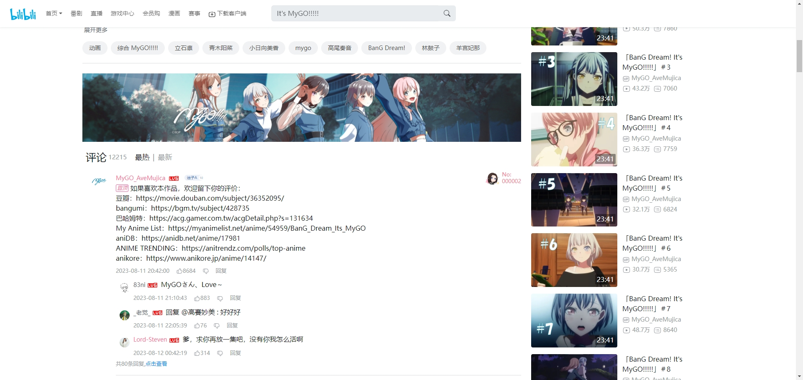
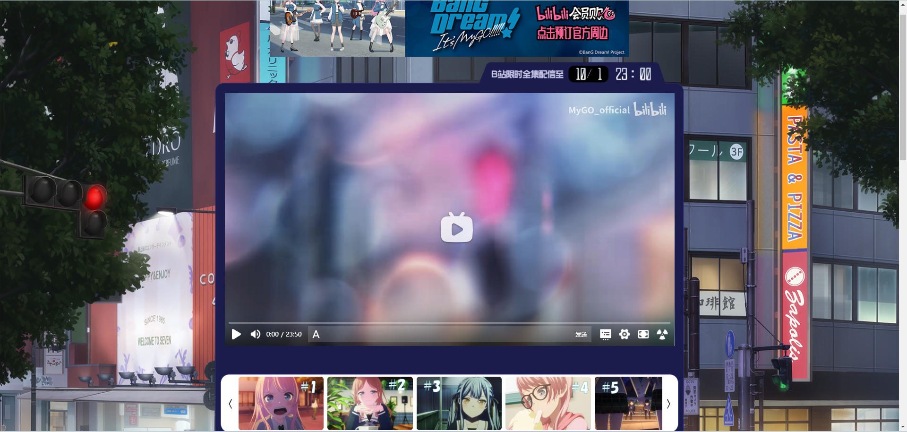

<h1 align="center">mygoFlaskProject</h1>

> 自上次 2023.10.01 mygo 在B站下架后，为了保留大家在B站观看 mygo 的美好回忆，我爬取了评论和弹幕制作了这个可以本地启动的网页项目。

> 2024.04.08-2024.04.17 为了庆祝活动 mygo 又再次短暂上架，我对数据进行了更新，页面做了重构。

<a href=https://www.bilibili.com/video/BV1Ww411C73f>B站视频链接</a>

# 预览：
   - 首页效果
      
   - 评论区效果
      
   - 活动页效果（视频播放器右侧广告区域点击跳转到这个页面）
      

## 请按照以下四种情况下载对应的资源进行操作

百度云盘（提取码：eyrw）：[链接](https://pan.baidu.com/s/1rlRCLZ8B32ozVbnlrGeggg?pwd=eyrw)

谷歌云盘：[链接](https://drive.google.com/drive/folders/1hOLUy8toxSi63UbNCoDNCAE9dRwuDbia?usp=sharing)

### 不包含本地视频资源与本地图片资源(下载体积最小)：

你有 mygo 的视频资源，不想下载评论区图片，则程序评论区图片使用 B站的图片地址，所以启动程序时电脑需要联网，否则图片都会加载失败。一些图片可能失效或被更改。

1. 下载对应文件夹里的压缩包。
2. 解压到任意位置。
3. 打开解压后的 `mygoFlaskProject` 文件夹，找到 `mygoFlaskProject/video` 文件夹，把视频资源放入其中（支持 MP4/WebM/Ogg/FLV/AVI/MKV/MOV/ 等类型的文件，具体可能还要看一下视频编码格式），注意在 Windows 默认排序下需要满足“1-12集、总集篇、13集、特别节目1-2”这个顺序，否则会导致集数错乱。如果错乱的话可以按 1-16 重命名视频文件，缺少的资源可以在网盘“视频资源”里下载。
4. 双击 `windows一键启动.bat` 启动,然后在浏览器中访问`127.0.0.1:5000`即可。

### 不包含本地含视频资源包含本地图片资源：

你有 mygo 的视频资源，希望下载评论区图片。

1. 下载对应文件夹里的压缩包。
2. 解压到任意位置。
3. 打开解压后的 `mygoFlaskProject` 文件夹，找到 `mygoFlaskProject/video` 文件夹，把视频资源放入其中（支持 MP4/WebM/Ogg/FLV/AVI/MKV/MOV/ 等类型的文件，具体可能还要看一下视频编码格式），注意在 Windows 默认排序下需要满足”1-12集、总集篇、13集、特别节目1-2“这个顺序，否则会导致集数错乱。如果错乱的话可以按 1-16 重命名视频文件，缺少的资源可以在网盘“视频资源”里下载。
4. 双击 `windows一键启动.bat` 启动,然后在浏览器中访问`127.0.0.1:5000`即可。

### 包含本地视频资源不包含本地图片资源：

你没有 mygo 的视频资源，不想下载评论区图片。则程序的评论区图片使用 B站的图片地址，所以启动程序时电脑需要联网，否则图片都会加载失败。一些图片可能失效或被更改。

1. 下载对应文件夹里的压缩包。
2. 解压到任意位置。
3. 双击 `windows一键启动.bat` 启动,然后在浏览器中访问`127.0.0.1:5000`即可。

### 包含本地视频资源与本地图片资源(下载体积最大)：

你没有 mygo 的视频资源，希望下载”视频资源“和”评论区图片“。

1. 下载对应文件夹里的压缩包。
2. 解压到任意位置。
3. 双击 `windows一键启动.bat` 启动,然后在浏览器中访问`127.0.0.1:5000`即可。

**常见问题**

- 缺少视频资源：在云盘中找到“视频资源”文件夹下载后放在 `mygoFlaskProject/video` 文件夹下。
- 视频有声音黑屏：说明自己准备的视频是 v265 格式，这个目前只有新的浏览器支持，下载安装谷歌浏览器解决。[谷歌官网](https://www.google.cn/chrome/index.html)。
- 视频不加载+评论区不加载：原因是火绒的拦截策略，临时关掉火绒或者B站私聊，改一下代码即可。
- 页面布局错乱：浏览器最大化后调整网页缩放即可。
- 感觉视频不够清楚：`mygoFlaskProject/video/`文件夹下放的是所有视频，替换为你的高清资源即可，[这里推荐一个阿里云盘资源](https://www.aliyundrive.com/s/4vHPUhfMMEK)。
- 运行后图片和视频加载慢：确保图片和视频被放在一个速度快的储存介质下，如固态硬盘，不要放在U盘中。如果还是卡那可能你需要换个新电脑了。
- 想在其他设备（如手机或平板）上观看：确保所有设备处于同一个局域网下，在其他设备上访问电脑命令行上第二行的局域网地址即可。推荐手机横屏观看。

## 开发环境启动

### 下载文件
   - 你可以直接从上面的两个网盘下载本仓库的完整版本或通过 `git clone git@github.com:wangwc18/mygoFlaskProject.git` 命令克隆仓库。但是你还是需要从网盘下载完整版压缩包，解压后将文件夹拷贝覆盖到本仓库下（缺少视频资源与图片资源）。
1. Python 环境启动
   - Step 1: 安装依赖
     - `pip3 install -r requirements.txt`
   - Step 2: 启动
     - `python app.py`
2. Conda 环境启动
   - Step 1: 新建 Conda 环境
     - `conda create -n mygo python=3.10`
     - `conda activate mygo`
     - `pip install -r requirements.txt`
   - Step 2: 启动
       - `python app.py` （若需更改端口，请编辑 `run_mode.json` 尾行的 `port`）
3. Docker 环境启动
   - Step 1: 拉取镜像：
      - `docker pull happyrespawnanchor/my-go-flask-project:24.4.17`
   - Step 2: 启动容器
      - `docker run -it -p 5000:5000 --rm -v /你自己/拥有的/视频位置:/mygo/video my-go-flask-project:24.4.17`（换成你的mygo视频路径） 
* 最后访问 `127.0.0.1:5000` 即可，如果你更改了端口，此处的5000也记得改掉。
## 项目结构
### 技术框架
`Python` + `Flask` + `Bootstrap` + `nPlayer`
### 数据获取

1. 弹幕有三种来源，这些文件在 `mygoFlaskProject/danmaku/` 下（做了重命名）
   - 标准弹幕(1文件夹)，使用“唧唧Down”获取 xml 和 ass 文件，只用 xml 文件。
   - 最多弹幕(2文件夹)，使用 B站的这篇专栏 [链接](https://www.bilibili.com/read/cv26903973/)，作者做了最大合并，里头还有各种其他类型的弹幕。
   - 开播弹幕(3文件夹)，后期弹幕和前期弹幕的观感不同（比如前期弹幕剧透更少），所以取了前 3000 条，这部分由 Gray Zhang 提供。
2. 同时下载了视频文件在 `mygoFlaskProject/video/` 下。
3. 剩余的数据为程序抓取，保存在 `mygoFlaskProject/get_data/` 目录下：
   - `get_basic_mess.py` 获取视频的基础信息（类似标题、播放数量、弹幕数量等）生成 `mygoFlaskProject/basic.json`。
   - `get_comment.py` 获取所有评论以及回复，生成三个文件夹 `comment_json_hot`、`comment_json_ne`w、`comment_json_more`，分别对应最热评论、最新评论、更多评论的原始 JSON。为了防止大语言模型的隐私泄露问题，原始评论数据我放网盘了。（PS: 由于 04.17 晚上 Cookie 过期导致爬取失败，现在的数据是 04.17 下午 2 点爬的，红豆泥斯米马赛。。。。。）
   - `get_pic.py` 爬取评论区图片。
   - `orginal_json_to_type.py` 原始 JSON 信息太多，把信息精简后放在 `mygoFlaskProject/` 下：
     - `comment_hot_json` 最热评论（JSON 中的图片链接为本地图片链接）。
     - `comment_new_json` 最新评论（JSON 中的图片链接为本地图片链接）。
     - `comment_more_json` 更多评论，评论回复中的“点击查看”加载出的评论（JSON 中的图片链接为本地图片链接）。
     - `comment_hot_json_online` 最热评论（JSON 中的图片链接为B站链接）。
     - `comment_new_json_online` 最新评论（JSON 中的图片链接为B站链接）。
     - `comment_more_json_online` 更多评论，评论回复中的“点击查看”加载出的评论（JSON 中的图片链接为 B站链接）。

### 视频组件

1. 本分支视频组件替换为使用 nplayer（[链接](https://github.com/oyuyue/nplayer)），
原本的项目是使用 dplayer（[链接](https://github.com/DIYgod/DPlayer)），但是有 Bug 迟迟不能修复。后续再研究一下添加新的功能。
2. 弹幕的用户播放配置写入 Cookie，但是由于 Bug 弹幕的透明度无法保存。

## 最后

- 超级感谢 B站月落云尘大佬对 nPlayer 视频组件的指路以及代码示范。
- 感谢B站 Darklyyy 对页面部分细节优化，制作的一个对 2k 屏幕适配的分支：[Better 2K](https://github.com/wangwc18/mygoFlaskProject/tree/better2k)。
- 感谢 GitHub 的 [Gray Zhang](https://github.com/otakustay) 大佬提供的新弹幕文件和建议。

有空用 Vue 重构一下前端（~~实在太懒~~
